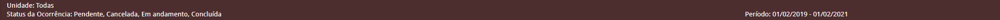

<link rel="stylesheet" type="text/css" media="all" href="../../../Assets/css/style.css" />

# Widgets

As widgts que majoritariamente constroem a página. São componentes que tem propriedades específicas que ajudam a construir.

```
project
│   backend
│   ci_scripts   
└───mobile
│   │   assets
│   └───bower_components
│       │   sortablejs
│       │   tek-libraries
│       └───zeedhi-fronted    
│           │   assets
│           └───widget
 ```

Sempre tem uma widget principal que engloba as outras widgets e podem existir outras "sub-widgets" dentro dessas.

 ## Listagem e utilização das widgets:

 + Stripe
    * A stripe é uma barra que fica acima de todos os outros componentes, e geralmente demonstra alguns dados do filtro que foi feito para trazer os dados
    ```json
        { 
            "name": "STRIPE_WIDGET",
            "template": "widget/stripe.html",
            "isVisible": true,
            "collapsible": true,
            "fields": []
        }
    ```

    

