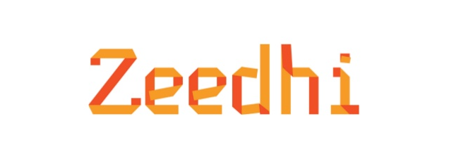

# Zeedhi

    

<strong>ESSA NÃO É UMA DOCUMENTAÇÃO OFICIAL É UM ESTUDO SOBRE O FRAMEWORK</strong>

Zeedhi é um framework criado pela Teknisa. Quis fazer essa documentação para aprender mais sobre ele e ter um norte próprio para utilização.

Abaixo você encontra um roadmap para utilizar.

## Frontend

00. [Introdução](Documentation/Frontend/Basics/00-Introducao.md)
01. [Containers](Documentation/Frontend/Basics/01-Containers.md)
02. [Widgets e Fields](Documentation/Frontend/Basics/02-Widgets-Fields.md)
03. [Propriedades](Documentation/Frontend/Basics/03-Propriedades.md)
04. [Eventos](Documentation/Frontend/Basics/04-Eventos.md)

## Como Contribuir
Contribuições fazem com que a comunidade open source seja um lugar incrível para aprender, inspirar e criar. Todas contribuições
são <strong>extremamente apreciadas</strong>

1. Realize um Fork do projeto
2. Crie um branch com a nova feature (`git checkout -b feature/novaFeature`)
3. Realize o Commit (`git commit -m 'Add some novaFeature'`)
4. Realize o Push no Branch (`git push origin feature/novaFeature`)
5. Abra um Pull Request

ou simplesmente, crie uma **ISSUE**

## Créditos

    

Todos os direitos do uso do framework Zeedhi pertecem a Teknisa. 

Documentação inicial criada por [Paulo Rievrs](https://www.linkedin.com/in/paulo-rievrs/)